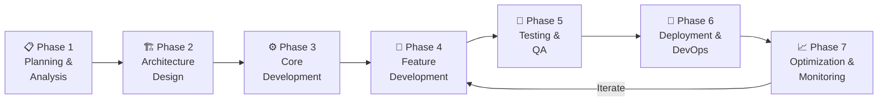
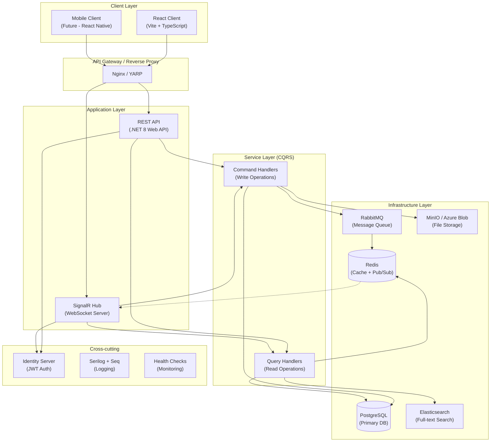
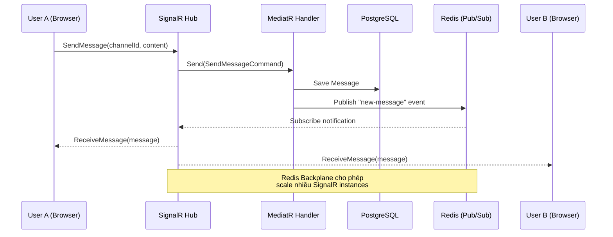
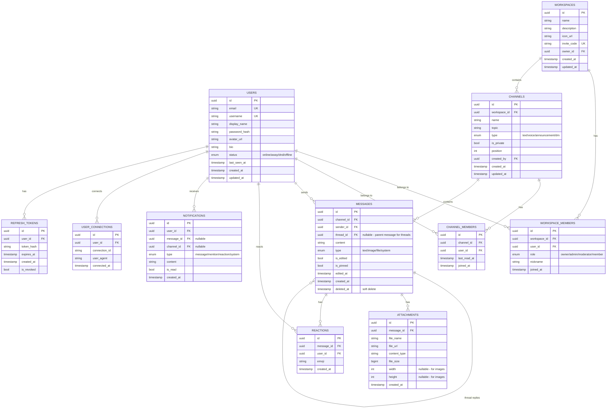
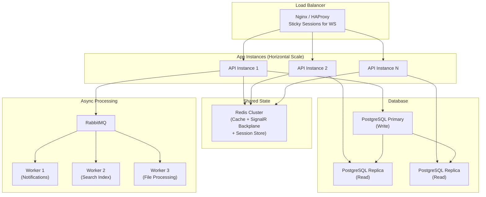
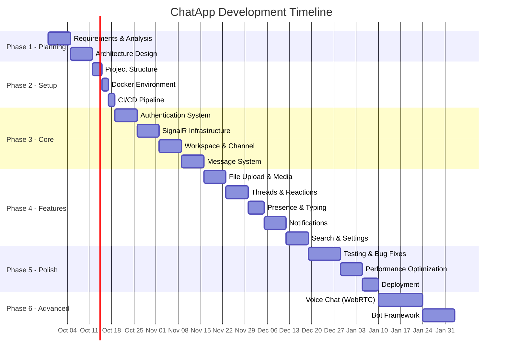

# 🚀 Real-Time Chat Application — Kế Hoạch Phát Triển Chi Tiết

## Mục Lục

1. [Phân Tích Các Ứng Dụng Chat Nổi Tiếng](#1-phân-tích-các-ứng-dụng-chat-nổi-tiếng)
2. [Đề Xuất Hướng Phát Triển](#2-đề-xuất-hướng-phát-triển)
3. [Quy Trình Phát Triển Phần Mềm](#3-quy-trình-phát-triển-phần-mềm)
4. [Kiến Trúc Hệ Thống](#4-kiến-trúc-hệ-thống)
5. [Cấu Trúc Code Chi Tiết](#5-cấu-trúc-code-chi-tiết)
6. [Danh Sách Chức Năng & Roadmap](#6-danh-sách-chức-năng--roadmap)
7. [Tech Stack Chi Tiết](#7-tech-stack-chi-tiết)
8. [Database Schema](#8-database-schema)
9. [API Design](#9-api-design)
10. [Performance & Scalability](#10-performance--scalability)
11. [Testing Strategy](#11-testing-strategy)
12. [DevOps & CI/CD](#12-devops--cicd)
13. [Timeline Phát Triển](#13-timeline-phát-triển)

---

## 1. Phân Tích Các Ứng Dụng Chat Nổi Tiếng

### So Sánh Tổng Quan

| Ứng dụng | Kiến trúc | Điểm mạnh | Điểm yếu | Độ phức tạp |
|-----------|-----------|------------|-----------|-------------|
| **Discord** | Microservices (Elixir/Rust/Python) | Voice/Video, Server/Channel model, Bot ecosystem | Quá phức tạp, tốn nhiều resource | ⭐⭐⭐⭐⭐ |
| **Slack** | Microservices (PHP → Go/Java) | Workspace model, Integration rich, Thread system | Nặng, phức tạp enterprise | ⭐⭐⭐⭐⭐ |
| **Telegram** | MTProto protocol, Distributed | Tốc độ cực nhanh, Bot API, Cloud-based | Protocol riêng, closed-source server | ⭐⭐⭐⭐ |
| **Signal** | Java/Rust backend | E2E Encryption mạnh, Privacy-first | Ít tính năng, UX đơn giản | ⭐⭐⭐ |
| **WhatsApp** | Erlang backend | 2 tỷ users, E2E mặc định | Closed ecosystem | ⭐⭐⭐⭐ |
| **Zalo** | Java backend | Phù hợp thị trường VN, Mini App | Ít tài liệu public | ⭐⭐⭐⭐ |
| **Microsoft Teams** | .NET/Azure | Enterprise-grade, Office 365 integration | Nặng, chậm | ⭐⭐⭐⭐⭐ |

### Phân Tích Chi Tiết Từng Ứng Dụng

#### 🟣 Discord — "The Gamer's Communication Platform"
- **Model**: Server → Category → Channel (Text/Voice/Stage)
- **Tech nổi bật**: WebSocket gateway, Real-time presence, Message history với lazy loading
- **Tính năng CV-worthy**: Real-time messaging at scale, role-based permissions, bot system
- **Bài học**: Channel-based architecture rất flexible và scalable

#### 🟢 Slack — "The Enterprise Communication Hub"
- **Model**: Workspace → Channel/DM → Thread
- **Tech nổi bật**: Event-driven architecture, Webhook system, Search indexing
- **Tính năng CV-worthy**: Thread-based conversations, rich integrations, workflow automation
- **Bài học**: Thread model giúp organize conversation tốt hơn

#### 🔵 Telegram — "Speed & Security Champion"
- **Model**: Chat (Private/Group/Channel/Supergroup)
- **Tech nổi bật**: MTProto protocol, CDN cho media, Bot API
- **Tính năng CV-worthy**: Custom protocol cho tốc độ, cloud sync, inline bots
- **Bài học**: Tối ưu protocol và message delivery tạo UX mượt mà

#### 🟡 Signal — "Privacy-First Messenger"
- **Model**: 1-1 Chat / Group Chat
- **Tech nổi bật**: Signal Protocol (E2E encryption), Sealed Sender
- **Tính năng CV-worthy**: End-to-end encryption implementation
- **Bài học**: Security-first design là điểm cộng lớn trong CV

---

## 2. Đề Xuất Hướng Phát Triển

### 🏆 Đề Xuất: Hybrid Discord + Slack Model

> [!IMPORTANT]
> **Tên dự án gợi ý: "NexusChat" hoặc "PulseChat"**
>
> Lấy mô hình **Workspace/Server → Channel → Thread** kết hợp tốt nhất từ Discord và Slack, với focus vào **hiệu năng cao** và **kiến trúc sạch** để ghi điểm CV.

### Lý do chọn hướng này:

| Tiêu chí | Lý do |
|----------|-------|
| **CV Impact cao** | Enterprise-grade architecture, Clean Architecture, CQRS, SignalR — đây là những keyword hot trong job market |
| **Scope vừa phải** | 1 domain (Chat) nhưng đủ sâu để showcase technical skills |
| **Scalable codebase** | Clean Architecture + DDD cho phép mở rộng dễ dàng |
| **Hiệu năng showcase** | SignalR + Redis + Message Queue = high-performance real-time system |
| **Học được nhiều** | Cover gần hết các pattern quan trọng: CQRS, Event Sourcing, Caching, WebSocket, Auth |

### Những điểm sẽ giúp CV nổi bật:

```
✅ Clean Architecture / Onion Architecture (.NET)
✅ CQRS + MediatR Pattern
✅ SignalR cho real-time communication  
✅ JWT + Refresh Token Authentication
✅ Redis caching & Pub/Sub
✅ Message Queue (RabbitMQ) cho async processing
✅ Docker containerization
✅ Unit Testing + Integration Testing
✅ CI/CD Pipeline
✅ Performance optimization (connection pooling, lazy loading, pagination)
```

---

## 3. Quy Trình Phát Triển Phần Mềm

### Methodology: Agile Scrum (Solo/Small Team Adapted)



### Phase 1: Planning & Analysis (Tuần 1-2)

| Task | Chi tiết | Output |
|------|----------|--------|
| Requirement Analysis | Liệt kê tất cả features, phân loại Must/Should/Could/Won't | PRD Document |
| User Story Mapping | Viết user stories cho từng feature | User Story Board |
| Technical Research | Nghiên cứu SignalR, Redis, RabbitMQ, React patterns | Technical Notes |
| Architecture Decision Records | Ghi lại lý do chọn tech/pattern | ADR Documents |
| UI/UX Wireframe | Sketch giao diện chính | Figma/Excalidraw |
| Database Design | Thiết kế ERD và schema | ERD Diagram |
| API Contract | Định nghĩa API endpoints | OpenAPI Spec |

### Phase 2: Architecture Design (Tuần 2-3)

| Task | Chi tiết |
|------|----------|
| Solution Architecture | Vẽ system architecture diagram |
| Project Structure Setup | Tạo solution structure theo Clean Architecture |
| CI/CD Pipeline Setup | GitHub Actions / Azure DevOps |
| Docker Setup | Dockerfile + docker-compose cho dev environment |
| Code Convention | Định nghĩa coding standards, linting rules |
| Git Workflow | Branch strategy (Git Flow hoặc Trunk-based) |

### Phase 3: Core Development (Tuần 3-6)

| Sprint | Focus |
|--------|-------|
| Sprint 1 | Authentication (JWT + Refresh Token), User Management |
| Sprint 2 | Real-time Infrastructure (SignalR Hub), Basic Messaging |
| Sprint 3 | Workspace/Server & Channel Management |
| Sprint 4 | Message History, Pagination, Search |

### Phase 4: Feature Development (Tuần 7-12)

| Sprint | Focus |
|--------|-------|
| Sprint 5 | File Upload/Media Sharing, Message Reactions |
| Sprint 6 | Thread System, Message Editing/Deletion |
| Sprint 7 | Online Presence, Typing Indicators, Read Receipts |
| Sprint 8 | Notification System (In-app + Push) |
| Sprint 9 | User Settings, Workspace Settings, Role Management |
| Sprint 10 | Search (Full-text), Message Pinning, Bookmarks |

### Phase 5: Testing & QA (Tuần 12-14)

| Loại Test | Tool | Phạm vi |
|-----------|------|---------|
| Unit Test | xUnit + Moq (.NET), Jest (React) | Business logic, Utilities |
| Integration Test | TestServer + Testcontainers | API endpoints, Database |
| E2E Test | Playwright | Critical user flows |
| Load Test | k6 / Artillery | WebSocket connections, Message throughput |
| Security Test | OWASP ZAP | Authentication, Authorization, XSS, CSRF |

### Phase 6: Deployment (Tuần 14-15)

| Task | Tool |
|------|------|
| Containerization | Docker + Docker Compose |
| Orchestration (optional) | Kubernetes / Docker Swarm |
| Cloud Deploy | Azure / AWS / DigitalOcean |
| SSL/TLS | Let's Encrypt / Cloudflare |
| Domain Setup | Custom domain configuration |
| Monitoring | Serilog + Seq / ELK Stack |

### Phase 7: Optimization (Tuần 15+)

| Focus | Techniques |
|-------|------------|
| Backend Performance | Connection pooling, Query optimization, Caching strategies |
| Frontend Performance | Code splitting, Lazy loading, Virtual scrolling |
| Real-time Performance | SignalR backplane (Redis), Connection management |
| Database Performance | Indexing, Partitioning, Read replicas |

---

## 4. Kiến Trúc Hệ Thống

### High-Level Architecture



### SignalR Real-time Flow



---

## 5. Cấu Trúc Code Chi Tiết

### Backend (.NET 8) — Clean Architecture

```
📦 ChatApp/
├── 📂 src/
│   ├── 📂 ChatApp.Domain/                    # 🟢 Domain Layer (Innermost)
│   │   ├── 📂 Common/
│   │   │   ├── BaseEntity.cs                  # Base entity với Id, CreatedAt, UpdatedAt
│   │   │   ├── BaseAuditableEntity.cs         # + CreatedBy, UpdatedBy
│   │   │   ├── BaseDomainEvent.cs             # Domain event base class
│   │   │   └── ValueObject.cs                 # Value object base class
│   │   ├── 📂 Entities/
│   │   │   ├── User.cs                        # User aggregate root
│   │   │   ├── Workspace.cs                   # Workspace aggregate root  
│   │   │   ├── Channel.cs                     # Channel entity
│   │   │   ├── Message.cs                     # Message entity
│   │   │   ├── Thread.cs                      # Thread entity
│   │   │   ├── Attachment.cs                  # File attachment entity
│   │   │   ├── Reaction.cs                    # Message reaction entity
│   │   │   ├── WorkspaceMember.cs             # Workspace membership
│   │   │   ├── ChannelMember.cs               # Channel membership
│   │   │   └── UserConnection.cs              # SignalR connection tracking
│   │   ├── 📂 Enums/
│   │   │   ├── ChannelType.cs                 # Text, Voice, Announcement
│   │   │   ├── MessageType.cs                 # Text, Image, File, System
│   │   │   ├── MemberRole.cs                  # Owner, Admin, Moderator, Member
│   │   │   ├── UserStatus.cs                  # Online, Away, DND, Offline
│   │   │   └── NotificationType.cs            # Message, Mention, Reaction, System
│   │   ├── 📂 Events/
│   │   │   ├── MessageSentEvent.cs
│   │   │   ├── MessageEditedEvent.cs
│   │   │   ├── MessageDeletedEvent.cs
│   │   │   ├── UserJoinedChannelEvent.cs
│   │   │   ├── UserLeftChannelEvent.cs
│   │   │   └── UserStatusChangedEvent.cs
│   │   ├── 📂 ValueObjects/
│   │   │   ├── MessageContent.cs              # Rich text content
│   │   │   ├── FileInfo.cs                    # File metadata
│   │   │   └── Mention.cs                     # @mention data
│   │   └── 📂 Exceptions/
│   │       ├── DomainException.cs
│   │       ├── NotFoundException.cs
│   │       └── ForbiddenException.cs
│   │
│   ├── 📂 ChatApp.Application/               # 🔵 Application Layer
│   │   ├── 📂 Common/
│   │   │   ├── 📂 Interfaces/
│   │   │   │   ├── IApplicationDbContext.cs   # DbContext abstraction
│   │   │   │   ├── ICurrentUserService.cs     # Current user info
│   │   │   │   ├── IDateTimeService.cs        # DateTime abstraction
│   │   │   │   ├── IFileStorageService.cs     # File upload/download
│   │   │   │   ├── ICacheService.cs           # Redis cache abstraction
│   │   │   │   ├── IEventPublisher.cs         # Domain event publisher
│   │   │   │   ├── INotificationService.cs    # Push notification
│   │   │   │   └── ISearchService.cs          # Full-text search
│   │   │   ├── 📂 Behaviors/
│   │   │   │   ├── ValidationBehavior.cs      # FluentValidation pipeline
│   │   │   │   ├── LoggingBehavior.cs         # Request/Response logging
│   │   │   │   ├── PerformanceBehavior.cs     # Slow query detection
│   │   │   │   └── CachingBehavior.cs         # Auto-caching pipeline
│   │   │   ├── 📂 Models/
│   │   │   │   ├── PaginatedList.cs           # Pagination wrapper
│   │   │   │   ├── Result.cs                  # Operation result pattern
│   │   │   │   └── CursorPaginatedList.cs     # Cursor-based pagination
│   │   │   ├── 📂 Mappings/
│   │   │   │   └── MappingProfile.cs          # AutoMapper profiles
│   │   │   └── 📂 Exceptions/
│   │   │       └── ApplicationException.cs
│   │   ├── 📂 Features/                       # CQRS Feature Folders
│   │   │   ├── 📂 Auth/
│   │   │   │   ├── 📂 Commands/
│   │   │   │   │   ├── Register/
│   │   │   │   │   │   ├── RegisterCommand.cs
│   │   │   │   │   │   ├── RegisterCommandHandler.cs
│   │   │   │   │   │   └── RegisterCommandValidator.cs
│   │   │   │   │   ├── Login/
│   │   │   │   │   │   ├── LoginCommand.cs
│   │   │   │   │   │   ├── LoginCommandHandler.cs
│   │   │   │   │   │   └── LoginCommandValidator.cs
│   │   │   │   │   └── RefreshToken/
│   │   │   │   │       ├── RefreshTokenCommand.cs
│   │   │   │   │       └── RefreshTokenCommandHandler.cs
│   │   │   │   └── 📂 DTOs/
│   │   │   │       ├── AuthResponse.cs
│   │   │   │       └── TokenPair.cs
│   │   │   ├── 📂 Messages/
│   │   │   │   ├── 📂 Commands/
│   │   │   │   │   ├── SendMessage/
│   │   │   │   │   │   ├── SendMessageCommand.cs
│   │   │   │   │   │   ├── SendMessageCommandHandler.cs
│   │   │   │   │   │   └── SendMessageCommandValidator.cs
│   │   │   │   │   ├── EditMessage/
│   │   │   │   │   │   ├── EditMessageCommand.cs
│   │   │   │   │   │   └── EditMessageCommandHandler.cs
│   │   │   │   │   ├── DeleteMessage/
│   │   │   │   │   │   ├── DeleteMessageCommand.cs
│   │   │   │   │   │   └── DeleteMessageCommandHandler.cs
│   │   │   │   │   └── ReactToMessage/
│   │   │   │   │       ├── ReactToMessageCommand.cs
│   │   │   │   │       └── ReactToMessageCommandHandler.cs
│   │   │   │   ├── 📂 Queries/
│   │   │   │   │   ├── GetMessages/
│   │   │   │   │   │   ├── GetMessagesQuery.cs
│   │   │   │   │   │   ├── GetMessagesQueryHandler.cs
│   │   │   │   │   │   └── MessageDto.cs
│   │   │   │   │   ├── GetPinnedMessages/
│   │   │   │   │   │   └── ...
│   │   │   │   │   └── SearchMessages/
│   │   │   │   │       └── ...
│   │   │   │   └── 📂 EventHandlers/
│   │   │   │       ├── MessageSentEventHandler.cs     # → Notify via SignalR
│   │   │   │       ├── MessageEditedEventHandler.cs
│   │   │   │       └── MessageDeletedEventHandler.cs
│   │   │   ├── 📂 Channels/
│   │   │   │   ├── 📂 Commands/
│   │   │   │   │   ├── CreateChannel/
│   │   │   │   │   ├── UpdateChannel/
│   │   │   │   │   ├── DeleteChannel/
│   │   │   │   │   ├── JoinChannel/
│   │   │   │   │   └── LeaveChannel/
│   │   │   │   └── 📂 Queries/
│   │   │   │       ├── GetChannels/
│   │   │   │       └── GetChannelById/
│   │   │   ├── 📂 Workspaces/
│   │   │   │   ├── 📂 Commands/
│   │   │   │   │   ├── CreateWorkspace/
│   │   │   │   │   ├── UpdateWorkspace/
│   │   │   │   │   ├── InviteMember/
│   │   │   │   │   └── RemoveMember/
│   │   │   │   └── 📂 Queries/
│   │   │   │       ├── GetWorkspaces/
│   │   │   │       └── GetWorkspaceMembers/
│   │   │   ├── 📂 Users/
│   │   │   │   ├── 📂 Commands/
│   │   │   │   │   ├── UpdateProfile/
│   │   │   │   │   └── UpdateStatus/
│   │   │   │   └── 📂 Queries/
│   │   │   │       ├── GetUserProfile/
│   │   │   │       └── SearchUsers/
│   │   │   └── 📂 Notifications/
│   │   │       ├── 📂 Commands/
│   │   │       │   └── MarkAsRead/
│   │   │       └── 📂 Queries/
│   │   │           └── GetNotifications/
│   │   └── DependencyInjection.cs
│   │
│   ├── 📂 ChatApp.Infrastructure/            # 🟠 Infrastructure Layer
│   │   ├── 📂 Persistence/
│   │   │   ├── ApplicationDbContext.cs        # EF Core DbContext
│   │   │   ├── 📂 Configurations/            # EF Core Fluent API
│   │   │   │   ├── UserConfiguration.cs
│   │   │   │   ├── WorkspaceConfiguration.cs
│   │   │   │   ├── ChannelConfiguration.cs
│   │   │   │   ├── MessageConfiguration.cs
│   │   │   │   └── ...
│   │   │   ├── 📂 Migrations/
│   │   │   ├── 📂 Interceptors/
│   │   │   │   ├── AuditableEntityInterceptor.cs   # Auto-fill audit fields
│   │   │   │   └── DomainEventInterceptor.cs       # Dispatch domain events
│   │   │   └── ApplicationDbContextInitializer.cs  # Seed data
│   │   ├── 📂 Identity/
│   │   │   ├── JwtTokenService.cs
│   │   │   ├── CurrentUserService.cs
│   │   │   └── PasswordHasher.cs
│   │   ├── 📂 Caching/
│   │   │   ├── RedisCacheService.cs
│   │   │   └── CacheKeys.cs                  # Centralized cache key management
│   │   ├── 📂 FileStorage/
│   │   │   ├── MinioFileStorageService.cs
│   │   │   └── LocalFileStorageService.cs     # Dev fallback
│   │   ├── 📂 Messaging/
│   │   │   ├── RabbitMqEventPublisher.cs
│   │   │   └── EventConsumerWorker.cs         # Background service
│   │   ├── 📂 Search/
│   │   │   └── ElasticsearchService.cs
│   │   └── DependencyInjection.cs
│   │
│   ├── 📂 ChatApp.WebAPI/                    # 🔴 Presentation Layer
│   │   ├── 📂 Controllers/
│   │   │   ├── ApiControllerBase.cs           # Base controller với MediatR
│   │   │   ├── AuthController.cs
│   │   │   ├── WorkspacesController.cs
│   │   │   ├── ChannelsController.cs
│   │   │   ├── MessagesController.cs
│   │   │   ├── UsersController.cs
│   │   │   └── NotificationsController.cs
│   │   ├── 📂 Hubs/
│   │   │   ├── ChatHub.cs                     # Main SignalR Hub
│   │   │   ├── PresenceHub.cs                 # Online/Offline tracking
│   │   │   └── NotificationHub.cs             # Real-time notifications
│   │   ├── 📂 Middleware/
│   │   │   ├── ExceptionHandlingMiddleware.cs # Global error handling
│   │   │   ├── RequestLoggingMiddleware.cs
│   │   │   └── RateLimitingMiddleware.cs
│   │   ├── 📂 Filters/
│   │   │   └── ApiExceptionFilterAttribute.cs
│   │   ├── appsettings.json
│   │   ├── appsettings.Development.json
│   │   ├── Program.cs
│   │   └── Dockerfile
│   │
│   └── 📂 ChatApp.Shared/                    # 📦 Shared Kernel
│       ├── Constants.cs
│       ├── 📂 DTOs/                           # Shared DTOs (BE-FE contract)
│       │   ├── MessageDto.cs
│       │   ├── ChannelDto.cs
│       │   └── UserDto.cs
│       └── 📂 SignalR/
│           ├── HubMethods.cs                  # Hub method name constants
│           └── HubEvents.cs                   # Client event name constants
│
├── 📂 tests/
│   ├── 📂 ChatApp.Domain.Tests/
│   ├── 📂 ChatApp.Application.Tests/
│   ├── 📂 ChatApp.Infrastructure.Tests/
│   ├── 📂 ChatApp.WebAPI.Tests/
│   └── 📂 ChatApp.IntegrationTests/
│       ├── CustomWebApplicationFactory.cs
│       └── 📂 Controllers/
│
├── 📂 client/                                 # React Frontend
│   └── (xem cấu trúc frontend bên dưới)
│
├── 📂 docker/
│   ├── docker-compose.yml                     # Full stack compose
│   ├── docker-compose.dev.yml                 # Dev overrides
│   └── 📂 nginx/
│       └── nginx.conf
│
├── ChatApp.sln
├── .gitignore
├── .editorconfig
├── README.md
└── Makefile                                   # Common dev commands
```

### Frontend (React + TypeScript + Vite)

```
📦 client/
├── 📂 public/
│   ├── favicon.ico
│   └── manifest.json
├── 📂 src/
│   ├── 📂 app/                                # App configuration
│   │   ├── App.tsx                             # Root component
│   │   ├── Router.tsx                          # React Router setup
│   │   ├── store.ts                            # Redux/Zustand store
│   │   └── providers.tsx                       # Context providers wrapper
│   │
│   ├── 📂 features/                           # Feature-based modules
│   │   ├── 📂 auth/
│   │   │   ├── 📂 components/
│   │   │   │   ├── LoginForm.tsx
│   │   │   │   ├── RegisterForm.tsx
│   │   │   │   └── AuthGuard.tsx
│   │   │   ├── 📂 hooks/
│   │   │   │   ├── useAuth.ts
│   │   │   │   └── useRefreshToken.ts
│   │   │   ├── 📂 services/
│   │   │   │   └── authApi.ts
│   │   │   ├── 📂 store/
│   │   │   │   └── authSlice.ts
│   │   │   └── 📂 pages/
│   │   │       ├── LoginPage.tsx
│   │   │       └── RegisterPage.tsx
│   │   │
│   │   ├── 📂 chat/
│   │   │   ├── 📂 components/
│   │   │   │   ├── MessageList.tsx             # Virtual scrolling messages
│   │   │   │   ├── MessageItem.tsx
│   │   │   │   ├── MessageInput.tsx            # Rich text input
│   │   │   │   ├── MessageReactions.tsx
│   │   │   │   ├── ThreadPanel.tsx
│   │   │   │   ├── TypingIndicator.tsx
│   │   │   │   └── EmojiPicker.tsx
│   │   │   ├── 📂 hooks/
│   │   │   │   ├── useMessages.ts
│   │   │   │   ├── useInfiniteScroll.ts
│   │   │   │   └── useTypingIndicator.ts
│   │   │   └── 📂 services/
│   │   │       └── messageApi.ts
│   │   │
│   │   ├── 📂 workspace/
│   │   │   ├── 📂 components/
│   │   │   │   ├── WorkspaceSidebar.tsx
│   │   │   │   ├── ChannelList.tsx
│   │   │   │   ├── ChannelItem.tsx
│   │   │   │   ├── CreateWorkspaceModal.tsx
│   │   │   │   └── MemberList.tsx
│   │   │   ├── 📂 hooks/
│   │   │   │   ├── useWorkspaces.ts
│   │   │   │   └── useChannels.ts
│   │   │   └── 📂 pages/
│   │   │       └── WorkspacePage.tsx
│   │   │
│   │   ├── 📂 user/
│   │   │   ├── 📂 components/
│   │   │   │   ├── UserAvatar.tsx
│   │   │   │   ├── UserProfile.tsx
│   │   │   │   ├── UserStatusBadge.tsx
│   │   │   │   └── UserSettings.tsx
│   │   │   └── 📂 hooks/
│   │   │       └── usePresence.ts
│   │   │
│   │   └── 📂 notifications/
│   │       ├── 📂 components/
│   │       │   ├── NotificationPanel.tsx
│   │       │   └── NotificationItem.tsx
│   │       └── 📂 hooks/
│   │           └── useNotifications.ts
│   │
│   ├── 📂 shared/                             # Shared/Common code
│   │   ├── 📂 components/
│   │   │   ├── 📂 ui/                         # Design system components
│   │   │   │   ├── Button.tsx
│   │   │   │   ├── Input.tsx
│   │   │   │   ├── Modal.tsx
│   │   │   │   ├── Dropdown.tsx
│   │   │   │   ├── Avatar.tsx
│   │   │   │   ├── Badge.tsx
│   │   │   │   ├── Tooltip.tsx
│   │   │   │   ├── Skeleton.tsx
│   │   │   │   └── Toast.tsx
│   │   │   └── 📂 layout/
│   │   │       ├── MainLayout.tsx
│   │   │       ├── Sidebar.tsx
│   │   │       └── Header.tsx
│   │   ├── 📂 hooks/
│   │   │   ├── useSignalR.ts                  # SignalR connection hook
│   │   │   ├── useDebounce.ts
│   │   │   ├── useLocalStorage.ts
│   │   │   └── useMediaQuery.ts
│   │   ├── 📂 services/
│   │   │   ├── apiClient.ts                   # Axios instance + interceptors
│   │   │   └── signalRService.ts              # SignalR connection manager
│   │   ├── 📂 utils/
│   │   │   ├── formatDate.ts
│   │   │   ├── formatFileSize.ts
│   │   │   └── validators.ts
│   │   └── 📂 types/
│   │       ├── api.types.ts
│   │       ├── message.types.ts
│   │       ├── channel.types.ts
│   │       ├── user.types.ts
│   │       └── signalr.types.ts
│   │
│   ├── 📂 styles/
│   │   ├── globals.css                        # CSS custom properties, reset
│   │   ├── variables.css                      # Design tokens
│   │   └── animations.css                     # Shared animations
│   │
│   ├── main.tsx                               # Entry point
│   └── vite-env.d.ts
│
├── index.html
├── vite.config.ts
├── tsconfig.json
├── package.json
├── .env.example
├── .eslintrc.cjs
├── .prettierrc
└── Dockerfile
```

---

## 6. Danh Sách Chức Năng & Roadmap

### 🔴 MVP (Must Have) — Phase 1

| # | Feature | Backend | Frontend | Priority |
|---|---------|---------|----------|----------|
| 1 | **User Registration & Login** | JWT + Refresh Token, BCrypt hashing | Login/Register forms, token management | P0 |
| 2 | **Real-time Messaging** | SignalR Hub, Message persistence | Message list with auto-scroll | P0 |
| 3 | **Workspace (Server) CRUD** | REST API, Authorization | Workspace sidebar, creation modal | P0 |
| 4 | **Channel CRUD** | REST API, Membership | Channel list, creation dialog | P0 |
| 5 | **Message History** | Cursor-based pagination | Infinite scroll, lazy loading | P0 |
| 6 | **Online Presence** | SignalR connection tracking, Redis | Green/yellow/red status dots | P0 |
| 7 | **Direct Messaging (DM)** | Private channel creation | DM section in sidebar | P0 |

### 🟡 Core Features — Phase 2

| # | Feature | Backend | Frontend | Priority |
|---|---------|---------|----------|----------|
| 8 | **Typing Indicators** | SignalR broadcast | "User is typing..." animation | P1 |
| 9 | **Message Reactions** | Reaction entity, Toggle API | Emoji picker, reaction bar | P1 |
| 10 | **File Upload** | MinIO/S3 storage, chunked upload | Drag & drop, progress bar, preview | P1 |
| 11 | **Message Edit/Delete** | Soft delete, edit history | Edit modal, delete confirmation | P1 |
| 12 | **Thread Replies** | Thread entity, nested messages | Thread panel (right sidebar) | P1 |
| 13 | **@Mentions** | Parse mentions, trigger notifications | Autocomplete dropdown, highlight | P1 |
| 14 | **Unread Message Count** | Track last read per user/channel | Badge counts on channels | P1 |
| 15 | **Notification System** | In-app + WebPush | Notification bell, toast popups | P1 |

### 🟢 Advanced Features — Phase 3

| # | Feature | Backend | Frontend | Priority |
|---|---------|---------|----------|----------|
| 16 | **Full-text Search** | Elasticsearch integration | Search bar, results with highlighting | P2 |
| 17 | **Message Pinning** | Pin entity, channel-level | Pin icon, pinned messages list | P2 |
| 18 | **Role-based Permissions** | RBAC system (Owner/Admin/Mod/Member) | Role management UI, permission checks | P2 |
| 19 | **Invite System** | Invite links with expiry | Invite modal, link sharing | P2 |
| 20 | **User Profile & Settings** | Profile API, preferences | Profile modal, settings page | P2 |
| 21 | **Dark/Light Theme** | N/A | CSS custom properties, theme toggle | P2 |
| 22 | **Message Formatting** | Markdown parser, sanitization | Rich text preview, code blocks | P2 |
| 23 | **Image/Link Preview** | Open Graph scraping, URL unfurling | Preview cards, image lightbox | P2 |

### 🔵 Premium Features — Phase 4 (CV Differentiators)

| # | Feature | Backend | Frontend | Priority |
|---|---------|---------|----------|----------|
| 24 | **Voice Chat (WebRTC)** | TURN/STUN server, SFU | Audio controls, voice channel UI | P3 |
| 25 | **Screen Sharing** | WebRTC data channel | Screen share viewer | P3 |
| 26 | **Bot Framework** | Bot API, Webhook system | Bot management UI | P3 |
| 27 | **Message Scheduling** | Background job (Hangfire) | Schedule picker UI | P3 |
| 28 | **Audit Logs** | Event sourcing, log aggregation | Admin audit dashboard | P3 |
| 29 | **Rate Limiting** | Token bucket / Sliding window | UI feedback for rate limits | P3 |
| 30 | **End-to-End Encryption** | Signal Protocol implementation | Key exchange UI, encrypted indicator | P3 |

---

## 7. Tech Stack Chi Tiết

### Backend

| Category | Technology | Lý do chọn |
|----------|-----------|-------------|
| **Runtime** | .NET 8 (LTS) | Performance tốt, cross-platform, LTS support |
| **Web Framework** | ASP.NET Core Web API | Industry standard, mature ecosystem |
| **Real-time** | SignalR | Built-in .NET, auto transport fallback (WS → SSE → Long Polling) |
| **ORM** | Entity Framework Core 8 | Powerful, LINQ support, migration system |
| **Database** | PostgreSQL 16 | Advanced features (JSONB, Full-text search), free, scalable |
| **Cache** | Redis (StackExchange.Redis) | In-memory speed, Pub/Sub for SignalR backplane |
| **Message Queue** | RabbitMQ (MassTransit) | Reliable async processing, dead letter queues |
| **File Storage** | MinIO (S3-compatible) | Self-hosted, S3 API compatible, free |
| **Search** | Elasticsearch (NEST) | Full-text search, powerful queries |
| **Auth** | JWT + BCrypt | Stateless auth, refresh token rotation |
| **Validation** | FluentValidation | Expressive validation rules, pipeline integration |
| **Mediator** | MediatR | CQRS pattern, pipeline behaviors |
| **Mapping** | Mapster hoặc AutoMapper | Object-to-object mapping |
| **Logging** | Serilog + Seq | Structured logging, powerful querying |
| **Health Check** | AspNetCore.Diagnostics.HealthChecks | DB, Redis, RabbitMQ health monitoring |
| **API Docs** | Swagger / Scalar | Auto-generated API documentation |
| **Testing** | xUnit + Moq + Testcontainers | Comprehensive testing ecosystem |

### Frontend

| Category | Technology | Lý do chọn |
|----------|-----------|-------------|
| **Build Tool** | Vite 5 | Blazing fast HMR, modern bundling |
| **Framework** | React 18 | Component model, huge ecosystem |
| **Language** | TypeScript 5 | Type safety, better DX |
| **State Management** | Zustand | Lightweight, simple API, good performance |
| **Server State** | TanStack Query (React Query) | Caching, background refetching, optimistic updates |
| **Routing** | React Router v6 | Standard, nested routes |
| **Styling** | CSS Modules + CSS Custom Properties | Scoped styles, themeable, no runtime cost |
| **Forms** | React Hook Form + Zod | Performance, validation |
| **Real-time** | @microsoft/signalr | Official SignalR client |
| **Virtual Scroll** | TanStack Virtual | Handle 1000s of messages efficiently |
| **Rich Text** | Tiptap / Slate.js | Extensible rich text editor |
| **Emoji** | emoji-mart | Comprehensive emoji picker |
| **Date** | date-fns | Lightweight date formatting |
| **Testing** | Vitest + React Testing Library | Fast, compatible with Vite |
| **E2E Testing** | Playwright | Cross-browser, reliable |

### DevOps & Infrastructure

| Category | Technology |
|----------|-----------|
| **Containerization** | Docker + Docker Compose |
| **CI/CD** | GitHub Actions |
| **Reverse Proxy** | Nginx |
| **SSL** | Let's Encrypt (Certbot) |
| **Monitoring** | Seq (Logging) + Grafana (Metrics) |
| **Cloud** | Azure / DigitalOcean / VPS |

---

## 8. Database Schema

### Entity Relationship Diagram



### Key Indexes

```sql
-- Performance-critical indexes
CREATE INDEX idx_messages_channel_created ON messages(channel_id, created_at DESC);
CREATE INDEX idx_messages_thread ON messages(thread_id) WHERE thread_id IS NOT NULL;
CREATE INDEX idx_messages_sender ON messages(sender_id);
CREATE INDEX idx_channel_members_user ON channel_members(user_id);
CREATE INDEX idx_workspace_members_user ON workspace_members(user_id);
CREATE INDEX idx_notifications_user_unread ON notifications(user_id) WHERE is_read = false;
CREATE INDEX idx_user_connections_user ON user_connections(user_id);
CREATE INDEX idx_messages_search ON messages USING gin(to_tsvector('english', content));
```

---

## 9. API Design

### REST API Endpoints

#### Authentication
```
POST   /api/auth/register          # Đăng ký
POST   /api/auth/login             # Đăng nhập
POST   /api/auth/refresh           # Refresh token
POST   /api/auth/logout            # Đăng xuất (revoke refresh token)
POST   /api/auth/forgot-password   # Quên mật khẩu
POST   /api/auth/reset-password    # Reset mật khẩu
```

#### Users
```
GET    /api/users/me               # Profile hiện tại
PUT    /api/users/me               # Cập nhật profile
PUT    /api/users/me/status        # Cập nhật status (online/away/dnd)
PUT    /api/users/me/avatar        # Upload avatar
GET    /api/users/{id}             # User profile
GET    /api/users/search?q=        # Tìm kiếm user
```

#### Workspaces
```
GET    /api/workspaces             # Danh sách workspace của user
POST   /api/workspaces             # Tạo workspace
GET    /api/workspaces/{id}        # Chi tiết workspace
PUT    /api/workspaces/{id}        # Cập nhật workspace
DELETE /api/workspaces/{id}        # Xóa workspace
GET    /api/workspaces/{id}/members         # Danh sách members
POST   /api/workspaces/{id}/members         # Invite member
DELETE /api/workspaces/{id}/members/{uid}   # Remove member
PUT    /api/workspaces/{id}/members/{uid}/role  # Thay đổi role
POST   /api/workspaces/join/{inviteCode}    # Join workspace qua invite
```

#### Channels
```
GET    /api/workspaces/{wid}/channels          # Danh sách channels
POST   /api/workspaces/{wid}/channels          # Tạo channel
GET    /api/channels/{id}                       # Chi tiết channel
PUT    /api/channels/{id}                       # Cập nhật channel
DELETE /api/channels/{id}                       # Xóa channel
POST   /api/channels/{id}/join                  # Join channel
POST   /api/channels/{id}/leave                 # Leave channel
GET    /api/channels/{id}/members               # Channel members
GET    /api/channels/{id}/pins                  # Pinned messages
```

#### Messages
```
GET    /api/channels/{cid}/messages             # Lấy messages (cursor pagination)
POST   /api/channels/{cid}/messages             # Gửi message (REST fallback)
GET    /api/messages/{id}                        # Chi tiết message
PUT    /api/messages/{id}                        # Edit message
DELETE /api/messages/{id}                        # Delete message
POST   /api/messages/{id}/pin                   # Pin/Unpin message
POST   /api/messages/{id}/reactions             # Add reaction
DELETE /api/messages/{id}/reactions/{emoji}      # Remove reaction
GET    /api/messages/{id}/thread                 # Thread replies
```

#### Files
```
POST   /api/files/upload            # Upload file (multipart)
GET    /api/files/{id}              # Download file
DELETE /api/files/{id}              # Delete file
```

#### Notifications
```
GET    /api/notifications           # Danh sách notifications
PUT    /api/notifications/read      # Mark all as read
PUT    /api/notifications/{id}/read # Mark one as read
```

#### Search
```
GET    /api/search/messages?q=&workspace=&channel=   # Search messages
GET    /api/search/users?q=                           # Search users
```

### SignalR Hub Methods

#### Client → Server (Invoke)
```csharp
// Chat Hub
SendMessage(channelId, content, attachmentIds[], replyToId?)
EditMessage(messageId, newContent)
DeleteMessage(messageId)
AddReaction(messageId, emoji)
RemoveReaction(messageId, emoji)
StartTyping(channelId)
StopTyping(channelId)
JoinChannel(channelId)
LeaveChannel(channelId)
MarkAsRead(channelId, messageId)

// Presence Hub
UpdateStatus(status)  // online, away, dnd, offline
```

#### Server → Client (Events)
```csharp
// Chat Events
ReceiveMessage(MessageDto message)
MessageEdited(MessageEditedDto data)
MessageDeleted(string channelId, string messageId)
ReactionAdded(ReactionDto reaction)
ReactionRemoved(string messageId, string emoji, string userId)
UserTyping(string channelId, UserDto user)
UserStoppedTyping(string channelId, string userId)

// Presence Events
UserOnline(string userId)
UserOffline(string userId)
UserStatusChanged(string userId, string status)

// Notification Events
NewNotification(NotificationDto notification)
UnreadCountUpdated(string channelId, int count)

// Channel Events
ChannelCreated(ChannelDto channel)
ChannelUpdated(ChannelDto channel)
ChannelDeleted(string channelId)
MemberJoined(string channelId, UserDto user)
MemberLeft(string channelId, string userId)
```

---

## 10. Performance & Scalability

### Backend Optimization Strategies

| Strategy | Implementation | Impact |
|----------|---------------|--------|
| **Connection Pooling** | Npgsql connection pool (min 10, max 100) | Reduce DB connection overhead |
| **Redis Caching** | Cache user profiles, channel info, member lists (TTL 5-15min) | Reduce DB reads by 60-80% |
| **Cursor Pagination** | Use `created_at + id` cursor instead of OFFSET | O(1) vs O(n) for deep pages |
| **Batch Operations** | Batch notification inserts, bulk cache invalidation | Reduce round-trips |
| **SignalR Groups** | Group connections by channel, only broadcast to relevant clients | Minimize network traffic |
| **Redis Backplane** | SignalR Redis backplane for multi-instance deployment | Horizontal scaling |
| **Message Queue** | Offload notification, search indexing, file processing to RabbitMQ | Non-blocking request handling |
| **Response Compression** | Brotli + Gzip compression middleware | Reduce payload size 60-70% |
| **Database Indexes** | Strategic indexes on hot queries (messages by channel, unread counts) | Sub-ms query time |
| **EF Core Optimization** | `AsNoTracking()`, projection queries, split queries | Reduce memory allocation |

### Frontend Optimization Strategies

| Strategy | Implementation | Impact |
|----------|---------------|--------|
| **Virtual Scrolling** | TanStack Virtual for message list | Render only visible messages (DOM nodes: ~30 vs 10,000+) |
| **Code Splitting** | React.lazy + Suspense per route | Reduce initial bundle 40-60% |
| **Optimistic Updates** | Update UI before server confirmation | Perceived instant responses |
| **Debounced Search** | 300ms debounce on search input | Reduce API calls |
| **Image Lazy Loading** | IntersectionObserver for images | Reduce bandwidth |
| **WebSocket Reconnection** | Automatic reconnect with exponential backoff | Resilient connection |
| **Service Worker** | Cache static assets, offline indicator | Faster subsequent loads |
| **Memoization** | React.memo, useMemo, useCallback | Prevent unnecessary re-renders |

### Scalability Architecture



### Performance Targets

| Metric | Target | Measurement |
|--------|--------|-------------|
| Message delivery latency | < 100ms (P99) | From send to receive on other client |
| API response time | < 200ms (P95) | REST endpoint response |
| WebSocket connection | < 500ms | Initial handshake |
| Time to Interactive | < 3s | First meaningful paint |
| Concurrent WebSocket connections | 10,000+ per instance | SignalR connections |
| Messages per second | 5,000+ | Sustained throughput |
| Search response time | < 500ms | Full-text search query |

---

## 11. Testing Strategy

### Testing Pyramid

```
           ╱╲
          ╱  ╲         E2E Tests (Playwright)
         ╱ 5% ╲        - Critical user flows only
        ╱──────╲
       ╱        ╲      Integration Tests (TestServer + Testcontainers)
      ╱   20%    ╲     - API endpoints, DB operations, SignalR hubs
     ╱────────────╲
    ╱              ╲    Unit Tests (xUnit + Vitest)
   ╱     75%        ╲   - Business logic, Validators, Utilities
  ╱──────────────────╲
```

### Backend Test Examples

```csharp
// Unit Test (Application Layer)
[Fact]
public async Task SendMessage_ValidCommand_ReturnsMessageId()
{
    // Arrange
    var command = new SendMessageCommand 
    { 
        ChannelId = _channelId, 
        Content = "Hello World" 
    };
    
    // Act
    var result = await _handler.Handle(command, CancellationToken.None);
    
    // Assert
    result.Should().NotBeEmpty();
    _mockDbContext.Verify(x => x.Messages.AddAsync(It.IsAny<Message>(), default), Times.Once);
}

// Integration Test
[Fact]
public async Task GetMessages_ReturnsPagedResults()
{
    // Arrange - seed data in test DB
    var client = _factory.CreateClient();
    client.DefaultRequestHeaders.Authorization = new AuthenticationHeaderValue("Bearer", _token);
    
    // Act
    var response = await client.GetAsync($"/api/channels/{_channelId}/messages?limit=20");
    
    // Assert
    response.StatusCode.Should().Be(HttpStatusCode.OK);
    var messages = await response.Content.ReadFromJsonAsync<PaginatedList<MessageDto>>();
    messages.Items.Should().HaveCountLessOrEqualTo(20);
}
```

---

## 12. DevOps & CI/CD

### Docker Compose (Development)

```yaml
# docker-compose.dev.yml
services:
  api:
    build: ./src/ChatApp.WebAPI
    ports: ["5000:8080"]
    depends_on: [postgres, redis, rabbitmq]
    environment:
      - ASPNETCORE_ENVIRONMENT=Development
      - ConnectionStrings__DefaultConnection=Host=postgres;Database=chatapp;Username=postgres;Password=postgres
      - Redis__Connection=redis:6379
      - RabbitMQ__Host=rabbitmq
    volumes:
      - ./src:/app/src  # Hot reload
    
  client:
    build: ./client
    ports: ["3000:3000"]
    volumes:
      - ./client/src:/app/src  # HMR

  postgres:
    image: postgres:16-alpine
    ports: ["5432:5432"]
    environment:
      POSTGRES_DB: chatapp
      POSTGRES_PASSWORD: postgres
    volumes:
      - pgdata:/var/lib/postgresql/data

  redis:
    image: redis:7-alpine
    ports: ["6379:6379"]

  rabbitmq:
    image: rabbitmq:3-management-alpine
    ports: ["5672:5672", "15672:15672"]

  minio:
    image: minio/minio
    ports: ["9000:9000", "9001:9001"]
    command: server /data --console-address ":9001"
    volumes:
      - minio_data:/data

  seq:
    image: datalust/seq
    ports: ["5341:80"]
    environment:
      ACCEPT_EULA: "Y"

volumes:
  pgdata:
  minio_data:
```

### GitHub Actions CI/CD Pipeline

```yaml
# .github/workflows/ci.yml
name: CI/CD Pipeline

on:
  push:
    branches: [main, develop]
  pull_request:
    branches: [main]

jobs:
  backend-test:
    runs-on: ubuntu-latest
    services:
      postgres:
        image: postgres:16
        env:
          POSTGRES_PASSWORD: postgres
        ports: [5432:5432]
      redis:
        image: redis:7
        ports: [6379:6379]
    steps:
      - uses: actions/checkout@v4
      - uses: actions/setup-dotnet@v4
        with:
          dotnet-version: '8.0.x'
      - run: dotnet restore
      - run: dotnet build --no-restore
      - run: dotnet test --no-build --collect:"XPlat Code Coverage"

  frontend-test:
    runs-on: ubuntu-latest
    steps:
      - uses: actions/checkout@v4
      - uses: actions/setup-node@v4
        with:
          node-version: '20'
      - run: cd client && npm ci
      - run: cd client && npm run lint
      - run: cd client && npm run test
      - run: cd client && npm run build

  deploy:
    needs: [backend-test, frontend-test]
    if: github.ref == 'refs/heads/main'
    runs-on: ubuntu-latest
    steps:
      - uses: actions/checkout@v4
      - run: docker compose -f docker-compose.prod.yml build
      - run: docker compose -f docker-compose.prod.yml push
      # Deploy to server via SSH or cloud provider
```

---

## 13. Timeline Phát Triển

### Tổng Quan (~16-20 tuần cho solo developer)



### Chi Tiết Từng Sprint (2-week sprints)

| Sprint | Tuần | Focus | Deliverables |
|--------|------|-------|-------------|
| **Sprint 0** | 1-2 | Planning & Setup | PRD, Architecture docs, Project scaffolding, Docker, CI/CD |
| **Sprint 1** | 3-4 | Auth + Users | Register, Login, JWT, Profile, Frontend auth flow |
| **Sprint 2** | 5-6 | Real-time Core | SignalR hub, Basic messaging, Message list UI |
| **Sprint 3** | 7-8 | Workspace & Channels | CRUD APIs, Sidebar UI, Channel navigation |
| **Sprint 4** | 9-10 | Messages Advanced | Pagination, Edit/Delete, Reactions, DM |
| **Sprint 5** | 11-12 | Files & Threads | Upload system, Thread panel, Image preview |
| **Sprint 6** | 13-14 | Presence & Notifications | Online status, Typing indicators, Notification system |
| **Sprint 7** | 15-16 | Search & Settings | Full-text search, User settings, Workspace settings |
| **Sprint 8** | 17-18 | Testing & Optimization | Unit tests, Integration tests, Performance tuning |
| **Sprint 9** | 19-20 | Deploy & Polish | Production deployment, Bug fixes, Documentation |

---

## Kết Luận

> [!TIP]
> ### Key Takeaways cho CV
>
> Khi hoàn thành project này, bạn sẽ có thể showcase:
>
> 1. **Clean Architecture** — Separation of concerns, dependency inversion
> 2. **CQRS + MediatR** — Command/Query segregation, pipeline behaviors
> 3. **Real-time System** — SignalR WebSocket, presence tracking, typing indicators
> 4. **Performance Engineering** — Redis caching, virtual scrolling, cursor pagination
> 5. **Distributed Systems** — Message queues, event-driven architecture
> 6. **Security** — JWT auth, refresh token rotation, RBAC
> 7. **DevOps** — Docker, CI/CD, monitoring
> 8. **Testing** — Unit, Integration, E2E testing pyramid
>
> Đây là một project **"sâu 1 domain"** nhưng cover **rất rộng về technical skills** — chính xác là thứ mà interviewer muốn thấy trong CV.

> [!IMPORTANT]
> ### Bước tiếp theo
> 
> Bạn muốn bắt đầu từ đâu?
> 1. **Setup project structure** (Solution + Docker + CI/CD)
> 2. **Database schema** (EF Core entities + migrations)
> 3. **Authentication system** (JWT + SignalR auth)
> 4. **UI Design mockup** (React layout + components)
> 
> Hãy cho tôi biết để bắt đầu code! 🚀
