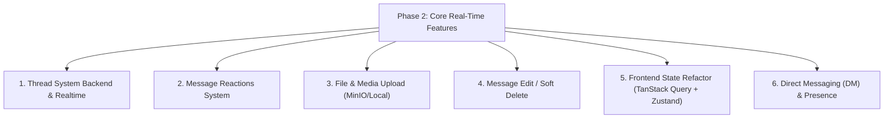

# 🗺️ NomNa — Kế Hoạch Giai Đoạn Kế Tiếp (Next Phase Roadmap)

> **Tài liệu bàn giao & định hướng cho phiên làm việc tiếp theo**  
> *Được cập nhật sau khi hoàn tất thiết kế giao diện, resizer và Atomic UI Primitives.*

---

## 1. Bối Cảnh & Trạng Thái Dự Án Hiện Tại

### 1.1 Backend (.NET 9 — Clean Architecture)
- **Kiến trúc**: Domain → Application → Infrastructure → WebAPI → Shared.
- **CQRS / MediatR**: Tuân thủ nghiêm ngặt nguyên tắc **File Separation**:
  - Mỗi Command tách làm 3 file: `{Name}Command.cs`, `{Name}CommandHandler.cs`, `{Name}CommandValidator.cs`.
  - Mỗi Query tách làm 2 file: `{Name}Query.cs`, `{Name}QueryHandler.cs`.
- **Database & Services**: PostgreSQL 16 + Redis (Docker container đang chạy lành mạnh), EF Core Migrations, ASP.NET Core Identity (JWT Access Token + Refresh Token).
- **Real-time**: SignalR Hub (`ChatHub`) hỗ trợ JoinChannel, SendMessage, StartTyping, StopTyping.

### 1.2 Frontend (React 19 + TypeScript + Vite)
- **Hệ thống Atomic UI (`client/src/shared/ui/`)**:
  - `Button`, `Input`, `Modal`, `Avatar`, `Badge` dùng 100% Tailwind CSS và token màu HSL/CSS variables.
- **Bố cục chính & Resizers**:
  - **Workspace Rail**: Cột 68px chuyển đổi không gian làm việc.
  - **Channel Sidebar**: Kéo chỉnh kích thước linh hoạt, chặn cứng chặn dưới **tối thiểu 200px** (`min-width: 200px`, max 450px).
  - **Chat Area**: Kênh chat chính với message stream, code snippet syntax, float actions, typing indicator.
  - **Thread Panel**: Kéo chỉnh kích thước linh hoạt, chặn cứng **tối thiểu 360px** (max 720px), **mặc định rộng 480px** và tự động giãn rộng khi focus gõ tin nhắn. Tích hợp thanh công cụ chat đầy đủ (Emoji popup, Code format, Đính kèm, Gửi ảnh, Reaction chips).
  - **Settings Modal & Auth Modal**: Đã khắc phục lỗi cascade padding của Tailwind CSS v4, giao diện kính mờ và dot-matrix sang trọng.

---

## 2. Giải Đáp: Tại Sao `globals.css` Hiện Còn Khá Dài?

### 2.1 Nguyên nhân (Technical Debt từ giai đoạn Prototype)
1. **Prototype ban đầu**: Khi dựng giao diện mẫu ban đầu, toàn bộ layout flex/grid và message stream được viết bằng các class CSS thuần tập trung trong `globals.css` (`.workspace-rail`, `.channels-sidebar`, `.chat-container`, `.message-stream`, `.input-card`, `.pane-resizer`...) để preview nhanh.
2. **Chiến lược tách dần**: Chúng ta đã refactor thành công lớp **Atomic UI Primitives** (`src/shared/ui/`) sang Tailwind CSS thuần túy. Tuy nhiên, các component container lớn (`WorkspaceRail`, `ChannelSidebar`, `ChatArea`, `ThreadPanel`) vẫn đang tạm thời kế thừa các class layout cũ trong `globals.css`.
3. **Mục đích giữ lại**: Để đảm bảo giao diện không bị gián đoạn hay vỡ khung trong lúc đang tập trung làm resizers và tinh chỉnh modal.

### 2.2 Kế hoạch dọn dẹp (Refactor Cleanup)
Trong giai đoạn tới, chúng ta sẽ thực hiện migrate toàn diện:
- Chuyển toàn bộ các class khung (`.channels-sidebar`, `.message-stream`, `.input-card`...) sang các utility class Tailwind trực tiếp trong JSX của component hoặc CSS Modules.
- Đưa `globals.css` về hình thái tinh giản chuẩn mực (~50-80 dòng): chỉ lưu trữ CSS Variables (Theme tokens: Warm Orange, Dark Zinc, Clean Coral), font import, và custom scrollbar.

---

## 3. Chi Tiết Giai Đoạn Kế Tiếp (Phase 2: Core Features & Full Integration)

Giai đoạn kế tiếp tập trung vào **kết nối sâu giữa Backend CQRS và Frontend Client**, đưa ứng dụng từ trạng thái "giao diện đẹp chạy mock data" thành một **hệ thống thời gian thực hoàn chỉnh đạt chuẩn Production**.



---

### Task 1: Hệ Thống Thread Replies Hoàn Chỉnh (Backend & Realtime)
- **Domain**:
  - Bổ sung `ParentMessageId` (nullable Guid), `ReplyCount` (int), và quan hệ 1-N `Replies` trong entity `Message`.
- **Application (CQRS)**:
  - `ReplyToMessageCommand` (`ReplyToMessageCommand.cs`, `ReplyToMessageCommandHandler.cs`, `ReplyToMessageCommandValidator.cs`).
  - `GetThreadRepliesQuery` (`GetThreadRepliesQuery.cs`, `GetThreadRepliesQueryHandler.cs`).
- **SignalR WebAPI**:
  - Phương thức Hub: `JoinThread(Guid parentMessageId)`, `SendThreadReply(Guid parentMessageId, string content)`.
  - Client Event: `ReceiveThreadReply`, `ThreadReplyCountUpdated`.
- **Frontend**:
  - Kết nối `ThreadPanel.tsx` gọi API lấy lịch sử phản hồi và nhận tin nhắn realtime qua SignalR thay vì mảng reply mẫu.

---

### Task 2: Hệ Thống Thả Cảm Xúc (Message Reactions)
- **Domain**:
  - Tạo entity `MessageReaction`: `Id`, `MessageId`, `UserId`, `Emoji` (string), `CreatedAt`.
  - Index: Unique composite index `(MessageId, UserId, Emoji)`.
- **Application (CQRS)**:
  - `ToggleReactionCommand` (Command, Handler, Validator) — tự động thêm nếu chưa có, xóa nếu đã tồn tại (toggle logic).
  - Tách sự kiện Domain Event `ReactionToggledEvent`.
- **SignalR**:
  - Client event `ReactionUpdated` thông báo đến toàn bộ user trong kênh khi có ai thả/hủy icon.
- **Frontend**:
  - Cập nhật số đếm và trạng thái active của chip cảm xúc tức thời (optimistic update).

---

### Task 3: Tải Lên Tệp Tin & Hình Ảnh (File / Media Storage)
- **Infrastructure**:
  - Xây dựng `IFileStorageService` trong Infrastructure:
    - Development: Lưu vào thư mục `wwwroot/uploads` hoặc Docker volume.
    - Production-ready: Kết nối MinIO (S3-compatible API).
- **WebAPI**:
  - Endpoint `POST /api/files/upload`: Validate MIME type, kiểm tra kích thước (tối đa 10MB cho ảnh/file). Trả về URL và metadata (`FileName`, `FileSize`, `ContentType`).
- **Frontend**:
  - Nối nút 📎 **Paperclip** và 🖼️ **Image** với `<input type="file" />`.
  - Hiển thị preview thanh tiến trình upload và render thẻ file đính kèm/ảnh phóng to trong bong bóng chat.

---

### Task 4: Chỉnh Sửa & Xóa Tin Nhắn (Edit / Soft Delete)
- **Domain**:
  - Bổ sung `IsEdited` (bool), `EditedAt` (DateTime?), `IsDeleted` (bool), `DeletedAt` (DateTime?).
- **Application (CQRS)**:
  - `EditMessageCommand` (kiểm tra quyền chỉ chủ sở hữu mới sửa được nội dung).
  - `DeleteMessageCommand` (chủ sở hữu hoặc Workspace Owner/Admin).
- **SignalR**:
  - Broadcast `MessageEdited(messageId, newContent)` và `MessageDeleted(messageId)`.
- **Frontend**:
  - Nút **PencilSimple** trên floating toolbar mở ô chỉnh sửa inline; nút xóa có hộp thoại xác nhận.

---

### Task 5: Refactor Frontend State & Dọn Dẹp CSS
- **Tuân thủ quy chuẩn `.agents/AGENTS.md`**:
  - Cài đặt & cấu hình **TanStack Query (React Query)** để quản lý Server State (Workspaces, Channels, Messages). Loại bỏ hoàn toàn việc lưu data API trong useState phân tán.
  - Sử dụng **Zustand** quản lý Client State (trạng thái mở/đóng modal, độ rộng sidebar `channelWidth`, `threadWidth`, theme).
  - **Dọn dẹp `globals.css`**: Chuyển các style layout container còn lại sang Tailwind CSS utility classes, đưa `globals.css` về dạng tinh gọn.
  - Cấu hình **React Router v6**: Chuyển Auth thành route riêng (`/login`, `/register`), kênh thành route (`/channels/:workspaceId/:channelId`).

---

### Task 6: Nhắn Tin Trực Tiếp (Direct Messaging - DM) & Trạng Thái Online
- **Domain & Application**:
  - Channel Type: `DM` (Direct Message) với logic tự động tìm hoặc tạo channel riêng giữa 2 User.
- **Presence Tracking**:
  - Khi user kết nối SignalR: Lưu trạng thái `online` vào Redis với TTL.
  - Khi disconnect: Cập nhật `last_seen_at` và broadcast trạng thái `offline`.
- **Frontend**:
  - Click vào user bất kỳ trong danh sách hoặc mục "Tin nhắn trực tiếp" sẽ mở cuộc hội thoại riêng 1-1.

---

## 4. Thứ Tự Triển Khai Đề Xuất (Execution Order Cho Hội Thoại Mới)

| Bước | Hạng Mục | Trọng Tâm | Thời Lượng Dự Kiến |
|---|---|---|---|
| **Bước 1** | **Thread Backend & SignalR Sync** | Thêm `ParentMessageId`, viết Command/Query MediatR, nối SignalR event cho `ThreadPanel` | 1 Sprint |
| **Bước 2** | **Message Reactions & Float Actions** | Entity `MessageReaction`, Toggle CQRS, SignalR broadcast cảm xúc | 1 Sprint |
| **Bước 3** | **File Storage & Upload Endpoint** | `IFileStorageService`, upload ảnh/tệp, render đính kèm | 1 Sprint |
| **Bước 4** | **Edit / Delete Message** | Soft delete, edit history, cập nhật tin nhắn realtime | 0.5 Sprint |
| **Bước 5** | **Frontend State & Clean CSS** | Tích hợp TanStack Query + Zustand, dọn dẹp `globals.css` sang Tailwind | 1 Sprint |

---

## 5. Mẫu Prompt Bàn Giao Khi Mở Hội Thoại Mới

Khi bạn tạo một phiên hội thoại mới trong Antigravity IDE, hãy dán prompt mẫu sau:

```markdown
Chào bạn, tôi đang tiếp tục phát triển dự án ChatApp (NomNa).
Hệ thống hiện tại đã hoàn thiện:
- Backend .NET 9 Clean Architecture + CQRS MediatR, Docker PostgreSQL + Redis, SignalR cơ bản.
- Frontend React 19 + TypeScript + Vite, Tailwind CSS, Atomic UI Primitives (`src/shared/ui/`), layout đa cột với resizer kéo chỉnh kích thước Channel & Thread.

Bạn hãy đọc file kế hoạch bàn giao chi tiết tại `plans/next_phase_roadmap.md` và `plans/implementation.md`.
Bây giờ chúng ta sẽ bắt đầu thực hiện **Bước 1: Triển khai hoàn chỉnh tính năng Thread Replies (Backend CQRS + SignalR + nối Frontend ThreadPanel)**. Hãy phân tích và đề xuất các bước code cụ thể nhé!
```
